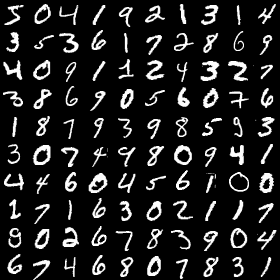

# MNIST in Python with sklearn

The mnist dataset and description was obtained from here:
[http://yann.lecun.com/exdb/mnist/](http://yann.lecun.com/exdb/mnist/)

This repository contains some utility functions for reading the MNIST data from
the fileformat they come in.

There is a script `create_image.py` that is useful for visualizing the mnist data.

Example:  
```bash
python create_image.py --input data\train-images.idx3-ubyte \
    --rows 10 --cols 10 \
    --output data\mnist_images_sm.png
```

This should output this image:  


There is a script `mnist_learning.py` that uses sklearn to train a model, and
score it's accuracy on the test data set.

Example:  
```bash
python mnist_learning.py --train_images data\train-images.idx3-ubyte \
    --train_labels data\train-labels.idx1-ubyte \
    --test_images data\t10k-images.idx3-ubyte \
    --test_labels data\t10k-labels.idx1-ubyte
```

You can choose what classifier you want to use below the comment  
```python
###
### CHOOSE MODEL HERE
###
```  
in the `mnist_learning.py` file.